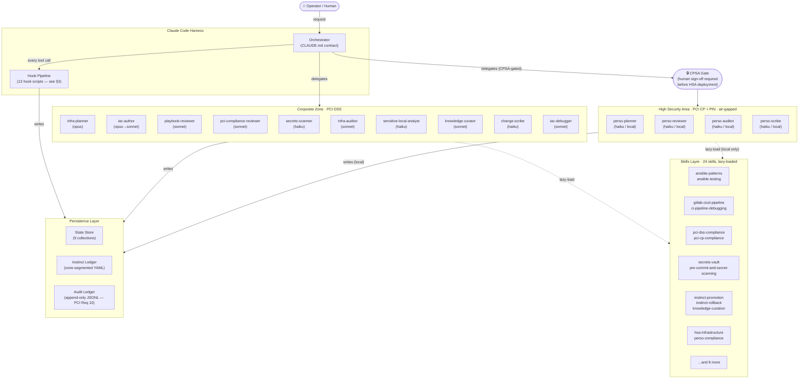
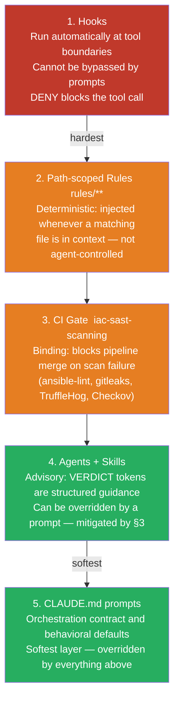
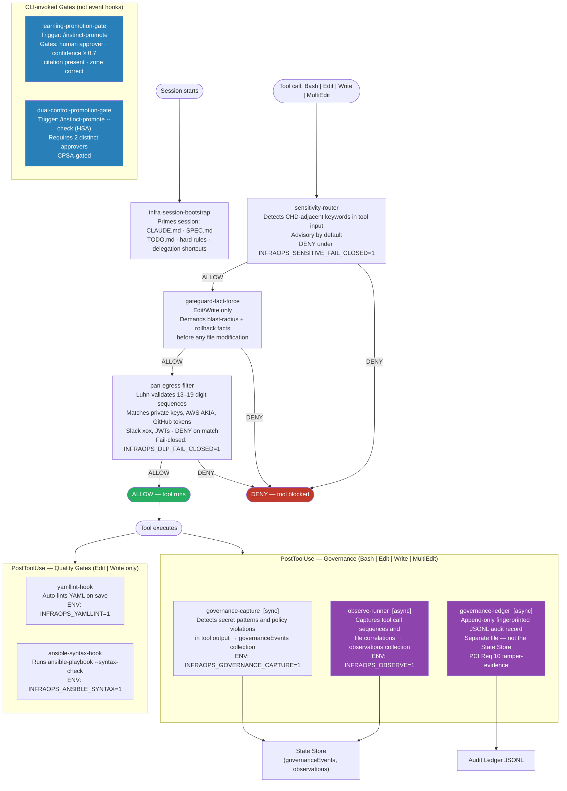
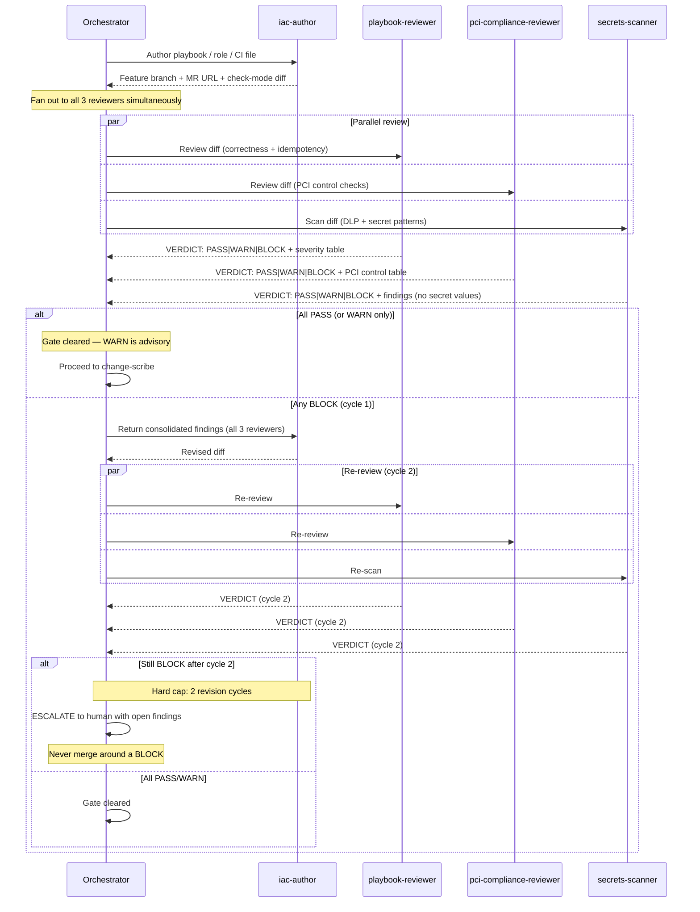
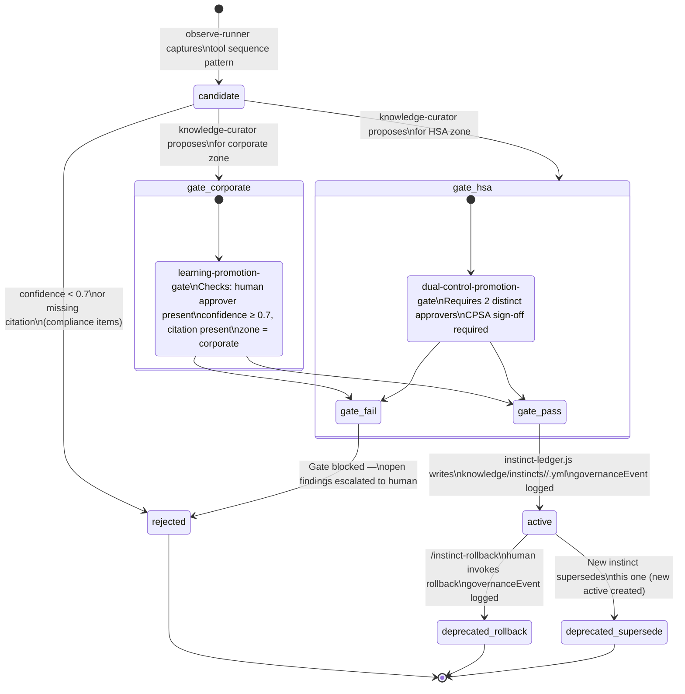

# infra-ops — Architecture Reference

_Last updated: 2026-06-06. Generated from SPEC.md, CLAUDE.md, deep-init-reference.md, hooks/hooks.json, and source files._

This document is the structural reference for the infra-ops Claude Code plugin. It describes the component layout, enforcement hierarchy, zone model, hook pipeline, agent roster, state store, and instinct lifecycle. For operational how-to workflows, see [`docs/workflows.md`](./workflows.md).

---

## 1. System Overview

infra-ops is a **Claude Code plugin** that wires Claude into a PCI-compliant DevOps orchestrator for an Ansible + GitLab CI/CD + Octopus Deploy estate at a credit-card manufacturer (PCI DSS + PCI Card Production + PCI PIN scope).

The key mental model: Claude acts as a **lean orchestrator** that classifies requests and delegates all specialist work to isolated subagent contexts. It never authors, reviews, or discovers inline.



---

## 2. Enforcement Hierarchy

Enforcement flows from hardest (hooks at the tool boundary) to softest (CLAUDE.md prompts). Understanding this hierarchy is essential — agents return advisory verdicts, but hooks and CI gates provide binding enforcement.



---

## 3. Hook Pipeline

Of the 13 hook scripts under `scripts/hooks/`, 9 are event-wired in `hooks/hooks.json` and auto-loaded by the harness; 2 gates are CLI-invoked, and the 2 in-zone guards (`hsa-boundary-guard`, `block-no-verify`) are registered in the HSA's own hooks config, not corporate. No hook appears in `plugin.json`.



---

## 4. Zone Model

The estate has two strictly separated security zones. The boundary is enforced by hooks at runtime and by network isolation in production.

```mermaid
flowchart LR
    subgraph Corp["CORPORATE ZONE  ·  PCI DSS"]
        direction TB
        CG["Self-hosted GitLab\n(CI/CD pipelines)"]
        CA["Ansible targets\n(Linux + Windows servers)"]
        CO["Octopus Deploy\n(multi-Tentacle release management)"]
        CM["Anthropic API\n(cloud inference — OK)"]
        CI["Instinct ledger\nknowledge/instincts/corporate/"]
    end

    subgraph Boundary["Zone Boundary"]
        direction TB
        SR2["sensitivity-router hook\nDetects CHD-adjacent content\nBlocks cloud path under fail-closed"]
        PEF2["pan-egress-filter hook\nLuhn + pattern match\nFail-closed DLP"]
        XFR["Artifact transfer only\nChange records only\nNo CHD crosses boundary"]
    end

    subgraph HSAZone["HIGH SECURITY AREA  ·  PCI CP + PIN"]
        direction TB
        HG["Air-gapped GitLab\n(no external network)"]
        HP["Personalization systems\n(card data prep)"]
        HO["Local Ollama inference\n(no cloud path — enforced)"]
        HSM["HSM\n(no agent access — ever)"]
        HI["Instinct ledger\nknowledge/instincts/hsa/"]
    end

    Corp -->|"artifact + change record"| Boundary
    Boundary -->|"artifact + change record\n(CPSA-gated)"| HSAZone

    classDef corp fill:#2c3e50,color:#fff
    classDef hsa fill:#6c3483,color:#fff
    classDef boundary fill:#c0392b,color:#fff
    class CG,CA,CO,CM,CI corp
    class HG,HP,HO,HSM,HI hsa
    class SR2,PEF2,XFR boundary
```



### Local lane — honest picture

The `sensitivity-router` hook detects CHD-adjacent keywords in tool input and, under `INFRAOPS_SENSITIVE_FAIL_CLOSED=1`, denies the tool call. The `sensitive-local-analyst` agent shells out to `ollama-router.js` for actual CHD-adjacent processing — output goes to an in-zone file and never returns into the cloud agent's context. The `model: haiku` frontmatter on HSA agents is a label, not enforcement; only the hook + shell-out combination achieves the real boundary.

---

## 5. Agent Roster and Delegation

All agents live in `agents/*.md` with YAML frontmatter and are **auto-discovered** — never listed in `plugin.json`. Each agent runs in a fresh, isolated context window.

```mermaid
flowchart TD
    Orch["Orchestrator\n(CLAUDE.md — lean, routing only)"]

    subgraph CAgents["Corporate Zone Agents"]
        direction LR
        IP2["infra-planner\nopus\nambiguous brief → phased plan"]
        IA2["iac-author\nopus→sonnet\nansible + CI authoring"]
        PR2["playbook-reviewer\nsonnet\ncorrectness + idempotency"]
        CR2["pci-compliance-reviewer\nsonnet\nPCI control checks"]
        SS3["secrets-scanner\nhaiku\nDLP static scan"]
        AU2["infra-auditor\nsonnet\nread-only discovery + drift"]
        SL2["sensitive-local-analyst\nhaiku (routing shell)\nCHD routing to local lane"]
        KC2["knowledge-curator\nsonnet\ndoc ingest + cited answers"]
        CS2["change-scribe\nhaiku\nchangelog + ADR + records"]
        DB2["iac-debugger\nsonnet\nred pipeline diagnosis"]
    end

    subgraph HSAAgents["HSA Zone Agents  (CPSA-gated deployment)"]
        direction LR
        PP2["perso-planner\nhaiku/local\nHSA brief → plan + dual-control gates"]
        PV2["perso-reviewer\nhaiku/local\nHSA MR review — CP+PIN controls"]
        PA2["perso-auditor\nhaiku/local\nHSA discovery + drift"]
        PS2["perso-scribe\nhaiku/local\nHSA change records"]
    end

    Orch --> IP2 & IA2 & AU2 & SL2 & KC2 & CS2 & DB2
    Orch --> PR2 & CR2 & SS3
    Orch -->|"CPSA gate"| PP2 & PV2 & PA2 & PS2

    IP2 -.->|"loads"| SK_IP["ansible-patterns\ngitlab-cicd-pipeline\noctopus-release\nmulti-env-promotion\nrollback-and-runbooks"]
    IA2 -.->|"loads"| SK_IA["ansible-patterns\nansible-testing\ngitlab-cicd-pipeline\noctopus-release\nmulti-env-promotion\nsecrets-vault\niac-sast-scanning\npre-commit-and-secret-scanning\nsupply-chain-and-sbom\nrollback-and-runbooks\nchange-documentation"]
    PR2 -.->|"loads"| SK_PR["ansible-patterns\nansible-testing\ngitlab-cicd-pipeline\niac-sast-scanning"]
    CR2 -.->|"loads"| SK_CR["pci-dss-compliance\npci-cp-compliance\nsecrets-vault\niac-sast-scanning\nsupply-chain-and-sbom\nincident-response"]
    SS3 -.->|"loads"| SK_SS["secrets-vault\npre-commit-and-secret-scanning"]
    AU2 -.->|"loads"| SK_AU["ansible-patterns\ndrift-detection"]
    SL2 -.->|"loads"| SK_SL["incident-response"]
    KC2 -.->|"loads"| SK_KC["knowledge-curation\ninstinct-promotion\ninstinct-rollback"]
    CS2 -.->|"loads"| SK_CS["change-documentation"]
    DB2 -.->|"loads"| SK_DB["ansible-patterns\nci-pipeline-debugging"]
    PP2 & PV2 & PA2 & PS2 -.->|"loads"| SK_HSA["hsa-infrastructure\nperso-compliance"]

    classDef hsa fill:#6c3483,color:#fff
    class PP2,PV2,PA2,PS2 hsa
```



---

## 6. The Review Gate

Every authored change passes through a deterministic three-way parallel review before reaching the merge gate. The orchestrator has **no discretion** on BLOCK verdicts.



---

## 7. State Store Schema

The State Store is a unified JSON persistence layer under `~/.infra-ops/state-store/` (configurable via `INFRAOPS_STATE_DIR`). Each collection is a separate JSON file; max 1,000 entries per collection with a 30-day TTL. Implementation: `scripts/lib/state-store.js`.

The **governance ledger** (`governance-ledger.js`) is separate by design — it writes a fingerprinted append-only JSONL file for tamper-evidence (PCI Req 10) and is never mixed with mutable state.

```mermaid
flowchart LR
    subgraph Session["Session Layer"]
        C1["sessions\nsessions.json\nSession tracking\nwritten by session hooks"]
        C2["installState\ninstall-state.json\nPlugin install tracking\nwritten by install hooks"]
        C3["workItems\nwork-items.json\nGitLab issue / task tracking\nwritten by work tracking"]
    end

    subgraph Learning["Learning Layer"]
        C4["skillRuns\nskill-runs.json\nSkill invocation history\nwritten by skill execution"]
        C5["skillVersions\nskill-versions.json\nVersion tracking for instinct skills\nwritten by promotion gate"]
        C6["decisions\ndecisions.json\nHuman decisions with rationale\nwritten by knowledge-curator"]
        C7["observations\nobservations.json\nTool-use patterns for learning loop\nwritten by observe-runner hook"]
        C8["knowledgeBase\nknowledge-base.json\nIngested doc index\nwritten by knowledge-curator"]
    end

    subgraph Gov["Governance Layer"]
        C9["governanceEvents\ngovernance-events.json\nSecret/policy detections\npromotion + rollback events\nwritten by governance-capture hook\nand instinct-ledger.js"]
    end

    subgraph Audit["Audit (separate — not State Store)"]
        AL2["governance-ledger.jsonl\nAppend-only fingerprinted JSONL\nPCI Req 10 tamper-evidence\nRead by siem-forwarder.js"]
    end

    OR2["observe-runner hook"] --> C7
    GC2["governance-capture hook"] --> C9
    IL2["instinct-ledger.js"] --> C9
    IL2 --> C5
    KC3["knowledge-curator"] --> C6
    KC3 --> C8
    GL2["governance-ledger hook"] --> AL2
    SF["siem-forwarder.js"] --> AL2
```



---

## 8. Instinct Lifecycle

Instincts are governed, versioned patterns promoted from observed tool sequences. Every promotion requires human involvement; no silent self-modification. The instinct ledger (`scripts/lib/instinct-ledger.js`) is the **only** writer of instinct YAML.



**Instinct YAML fields:** `id`, `zone`, `confidence`, `content`, `citation`, `evidence[]`, `approver`, `promoted_at`, `status`. The `status: active` and `promoted_by` fields are written by the gate only — never by the curator.

Ledger layout:

```
knowledge/instincts/
  corporate/   ← PCI DSS zone  (legacy alias: corpor)
  hsa/         ← PCI CP + PIN  (legacy alias: in-zone)
```

---

## 9. Skills Map

Skills live in `skills/<name>/SKILL.md` with frontmatter (`name`, `description`). They are **lazy-loaded** — each agent loads its skills by invoking the Skill tool when needed. Skills teach _how to apply_ a standard; hooks _enforce_ the standard.

| Skill | Agents that load it | Purpose |
|---|---|---|
| `ansible-patterns` | iac-author, playbook-reviewer, infra-auditor, iac-debugger | Repo layout, FQCN naming, idempotency patterns, mixed Windows/Linux |
| `ansible-testing` | iac-author, playbook-reviewer | yamllint → ansible-lint → syntax-check → check/diff → Molecule idempotence pipeline |
| `gitlab-cicd-pipeline` | iac-author, playbook-reviewer | Stages, `environment:`, protected envs, CI components, runner tag conventions |
| `octopus-release` | infra-planner, iac-author | GitLab→Octopus integration, lifecycle gates, manual-intervention steps |
| `multi-env-promotion` | infra-planner, iac-author | dev→test→staging→prod, build-once-promote-one-artifact pattern |
| `drift-detection` | infra-auditor | Scheduled `--check --diff`, ARA tagging, drift-to-alert pipeline |
| `secrets-vault` | iac-author, pci-compliance-reviewer, secrets-scanner | HashiCorp Vault references, runtime lookups, `no_log: true`, never plaintext |
| `pci-dss-compliance` | pci-compliance-reviewer | Corporate DSS controls (Req 3, 4, 6, 7, 8, 10) |
| `pci-cp-compliance` | pci-compliance-reviewer | Card Production Logical + PIN constraints for in-zone work |
| `change-documentation` | change-scribe, iac-author | Changelog, ADR, and per-change YAML record formats |
| `iac-sast-scanning` | playbook-reviewer, pci-compliance-reviewer | Binding CI gate: ansible-lint, gitleaks, TruffleHog, Checkov, SARIF output |
| `pre-commit-and-secret-scanning` | iac-author, secrets-scanner | Fast developer-machine tier; pre-commit mirrors CI gate |
| `supply-chain-and-sbom` | iac-author, pci-compliance-reviewer | SBOM via syft, artifact signing/attestation, dependency pinning (PCI 6.3.2) |
| `rollback-and-runbooks` | infra-planner, iac-author | Forward-fix vs rollback decision, artifact redeploy, break-glass procedures |
| `ci-pipeline-debugging` | iac-debugger | Safe job-log diagnosis, local EE reproduction, failure-signature reference table |
| `incident-response` | sensitive-local-analyst, pci-compliance-reviewer | Bounded agent role for PCI 12.10.x: contain / preserve / escalate |
| `knowledge-curation` | knowledge-curator | Document ingestion, sensitivity classification, cited-answer protocol |
| `instinct-promotion` | knowledge-curator | Promote observed patterns to governed instincts via the promotion gate |
| `instinct-rollback` | knowledge-curator | Rollback or deactivate instincts with governance event logging |
| `hsa-infrastructure` | perso-planner, perso-reviewer, perso-auditor, perso-scribe | Air-gap patterns, dual-control requirements, local-only Ansible/CI conventions |
| `perso-compliance` | perso-planner, perso-reviewer, perso-auditor, perso-scribe | PCI Card Production Logical + PIN infrastructure controls checklist |

---

## 10. Plugin Wiring

Components are auto-discovered by the harness. Nothing is manually listed except command and skill globs in `plugin.json`.

| Component | Discovery mechanism | Listed in plugin.json? |
|---|---|---|
| Agents | All `agents/*.md` with valid frontmatter | No — auto-discovered |
| Commands | Glob: `"commands": ["./commands/"]` | Via glob only |
| Skills | Glob: `"skills": ["./skills/"]` | Via glob only |
| Hooks | `hooks/hooks.json` — auto-loaded | No — never in plugin.json |
| Rules | `rules/**` with `paths:` frontmatter glob | Auto-injected on file match |

### Bundled MCP servers

| Server | Package | Purpose |
|---|---|---|
| `context7` | `@upstash/context7-mcp@latest` | Current library docs — resolve library ID, then fetch focused docs before authoring/reviewing any library, module, or API |
| `sequential-thinking` | `@modelcontextprotocol/server-sequential-thinking` | Structured multi-step reasoning |

### Key environment variables

| Variable | Default | Effect |
|---|---|---|
| `INFRAOPS_DLP_FAIL_CLOSED` | `false` | pan-egress-filter denies on parse error |
| `INFRAOPS_SENSITIVE_FAIL_CLOSED` | `false` | sensitivity-router denies CHD-adjacent tool calls |
| `INFRAOPS_OLLAMA_REQUIRE_LOCAL` | `1` | ollama-router refuses non-localhost endpoints |
| `OLLAMA_BASE_URL` | (none) | Local model endpoint for CHD-adjacent work |
| `INFRAOPS_AUDIT_FORWARD` | (none) | SIEM endpoint for governance ledger forwarding |
| `INFRAOPS_STATE_DIR` | `~/.infra-ops/state-store/` | State Store root directory |
| `INFRAOPS_GOVERNANCE_CAPTURE` | `1` | Enable governance-capture hook |
| `INFRAOPS_OBSERVE` | `1` | Enable observe-runner hook |

> **Note:** yamllint and ansible-syntax hooks still use `INFRA_OPS_YAMLLINT` and `INFRA_OPS_ANSIBLE_SYNTAX` prefixes. Standardising to `INFRAOPS_*` is a pre-1.0 task.
