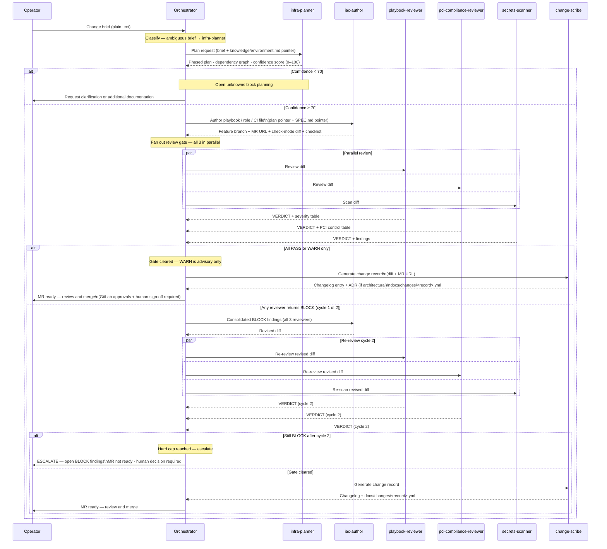
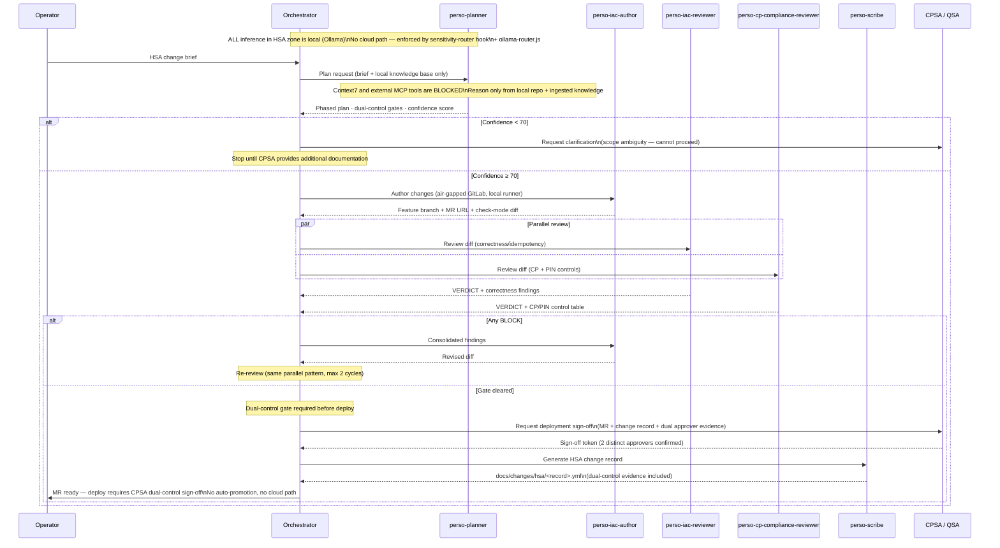
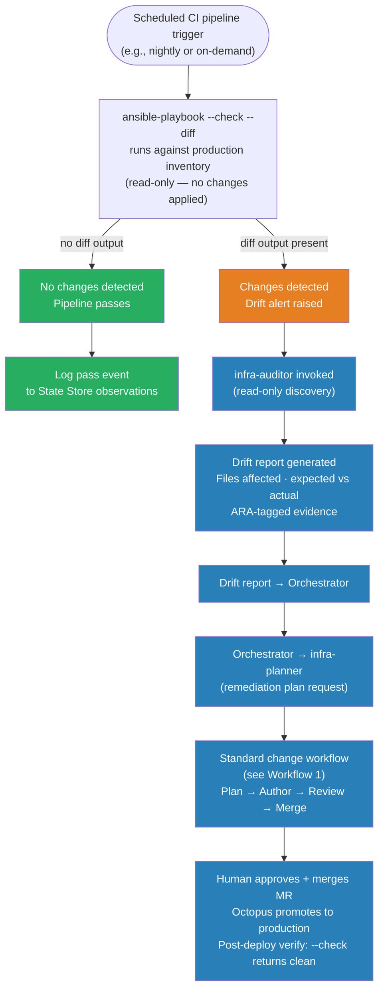
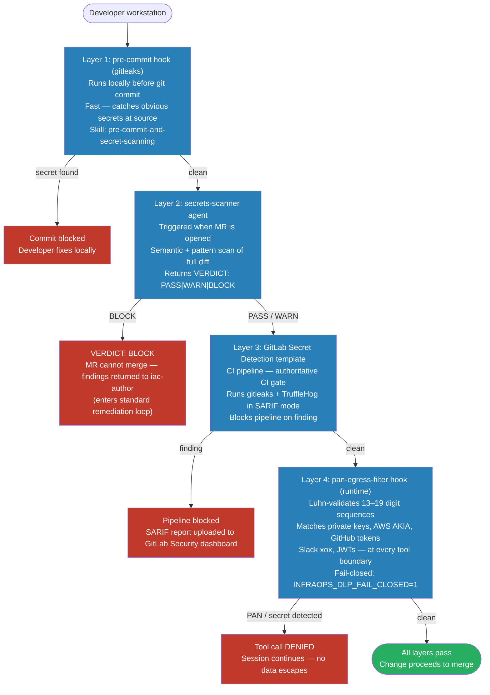
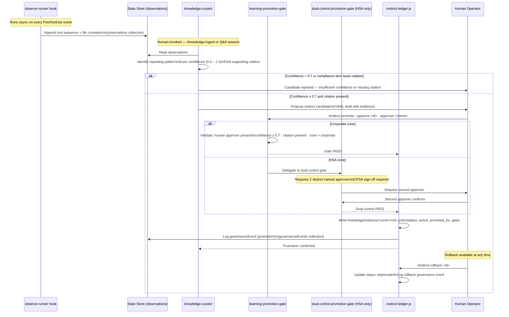
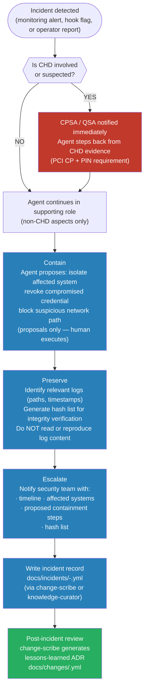
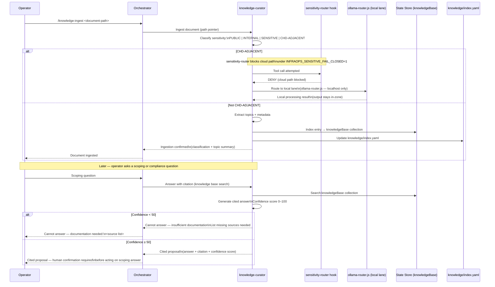

# infra-ops — Operational Workflows

_Last updated: 2026-06-06. Companion to [`docs/architecture.md`](./architecture.md) — this file is the operational how-to; architecture.md is the structural reference._

Each workflow below covers a named operation from trigger to completion. Diagrams carry the primary description; prose gives the key constraints and decision points.

---

## 1. Standard Infrastructure Change (end-to-end)

The normal path for any corporate-zone infrastructure change: planning → authoring → three-way review → change record → human merge.

The orchestrator never merges automatically. All promotions beyond Dev are human-gated (GitLab approvals + Octopus manual-intervention steps). The hard cap of two revision cycles prevents runaway loops; on second failure the open findings go directly to the operator.

---

## 2. HSA Change Workflow

Changes to the High Security Area (PCI Card Production + PIN) follow the same skeleton as the standard flow but with air-gap, dual-control, and CPSA-sign-off constraints at every step.

Key constraints that differ from the standard flow: no Context7 or external MCP calls from any HSA agent; all inference runs through `ollama-router.js` (localhost only, refuses non-local endpoints); the `dual-control-promotion-gate` requires two distinct named approvers; the CPSA deployment gate blocks all deploy actions until sign-off is recorded.

---

## 3. Drift Detection and Remediation

Drift is detected on a scheduled CI pipeline. When Ansible's check mode reports divergence from the desired state, the infra-auditor surfaces it and the finding feeds directly into the standard change workflow.

The `infra-auditor` is read-only — it produces evidence and a report but never applies changes. The `drift-detection` skill defines the ARA-tagging conventions and alert thresholds. Remediation always flows through the standard review gate; drift does not create an exception path.

---

## 4. Secret Detection — Layered Defence

Secret and PAN detection is a defence-in-depth stack. No single layer is the sole gate; all four must pass for a change to reach production.

Layer 4 (pan-egress-filter) runs on every tool call throughout the session — it is not limited to pre-merge. `INFRAOPS_DLP_FAIL_CLOSED=1` makes it deny even on parse errors, trading availability for certainty. The `governance-capture` hook logs any detected pattern to the `governanceEvents` State Store collection for audit.

---

## 5. Governed Learning Loop (Instinct Promotion)

The learning loop converts observed tool-use patterns into governed instincts. Every step except passive observation requires human involvement. No silent self-modification ever occurs.

The `instinct-ledger.js` library is the **only** writer of instinct YAML. The `knowledge-curator` drafts candidates but never writes directly to `knowledge/instincts/`. The `governance-ledger` hook writes an independent tamper-evident audit record of every promotion and rollback event.

---

## 6. Incident Response

The agent plays a bounded, supporting role during incidents — it never leads the response, never handles evidence directly for CHD incidents, and defers to security team authority immediately.

The `incident-response` skill (loaded by `sensitive-local-analyst` and `pci-compliance-reviewer`) codifies the contain/preserve/escalate pattern per PCI DSS Req 12.10.x and 12.10.7. The agent never directly handles evidence for CHD incidents — the CPSA/QSA takes ownership immediately upon CHD suspicion.

---

## 7. Knowledge Ingestion and Cited Answers

Documents are ingested through a classification gate before being stored. CHD-adjacent documents never travel through the cloud path. Answers to scoping questions are always cited, never guessed.

The `knowledge-curation` skill defines the classification taxonomy and the cited-answer protocol. All compliance answers are proposals requiring human confirmation — the system never acts on an unconfirmed scoping answer. Documents classified CHD-ADJACENT are kept out of the cloud context entirely; even their metadata is processed locally when `INFRAOPS_SENSITIVE_FAIL_CLOSED=1`.
